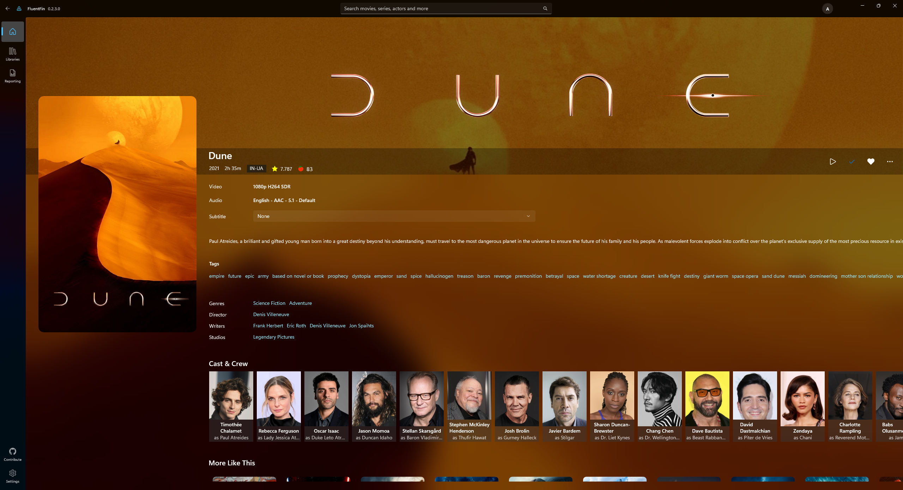
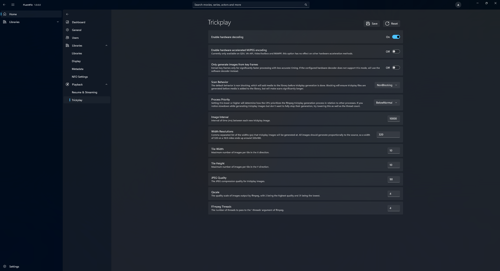
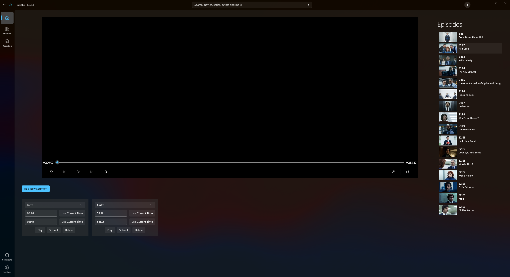
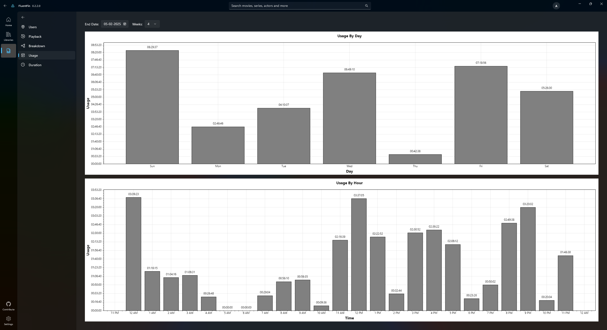

# 📺 FluentFin
Welcome to FluentFin, a simple and user-friendly native Jellyfin client built with [Windows App SDK](https://github.com/microsoft/WindowsAppSDK) and C# for window 10 and 11. If you're looking for an alternative to other Jellyfin clients, we hope you'll find FluentFin to be a useful addition to your media streaming toolbox.

  
  
  
  

## 🌟 Features

- 🚀 **Skip Intro / Credits Support**
- 🖼️ **Trickplay images**: The new golden standard for chapter previews when seeking.
- 👥 **Multiple server/users**: Seamlessly switch between multiple servers.
- 🖥️ **Local connection handling**: use internal network address / public address based on current network.
- 🎛️ **Transcoding and Direct Play**

## 🧪 Experimental Features

- 🛡️ **Jellyfin Dashboard**: manage jellyfin server directly from the application.
- 📺 **Media Segments Editor**: requires [jellyfin-plugin-ms-api](https://github.com/intro-skipper/jellyfin-plugin-ms-api/) and [Intro Skipper](https://github.com/intro-skipper/intro-skipper) plugins.
- 📡 **Remote Controllable**

## 🚀 Getting Started

### Prerequisites

- Ensure you have an active Jellyfin server.

## 🙌 Contributing

We welcome any help to make FluentFin better. If you'd like to contribute, please fork the repository and submit a pull request. For major changes, it's best to open an issue first to discuss your ideas.

### Development info

1. Use Visual Studio 2022 with .NET Desktop Development workload and Windows App SDK C# Templates
2. All files generated by the application will go to _C:\Users\<username>\AppData\Local\FluentFin_

## 📝 Credits
FluentFin is not affiliated with Jellyfin. The app is built with Windows App SDK, and other open-source libraries.

I'd like to thank the following people and projects for their contributions to FluentFin:

- [jellyfin-sdk-csharp](https://github.com/jellyfin/jellyfin-sdk-csharp) for the C# SDK.
- [CommunityToolkit Windows](https://github.com/CommunityToolkit/Windows)